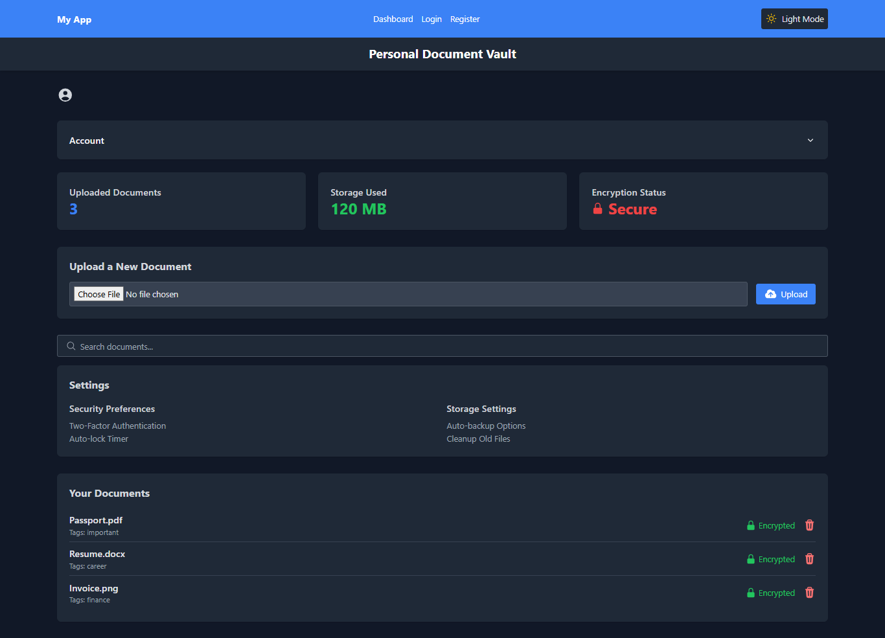

## INTRODUCTION

Personal Document Vault with encryption is a secure vault where users can upload and store their personal documents with encryption for privacyand security. The vault is designed to provide a safe and private space for users to store their sensitive documents, such as financial statements, tax returns, and other important documents. The vault is accessible only to the user who created it, and access is password-protected. The vault is designed to be easy to use and navigate, with a user-friendly interface that allows users to upload and store their documents securely. The vault is also designed to be highly secure, with encryption and other security measures in place to protect the user's documents from unauthorized access.

## FEATURES



- End-to-end encryption
- Secure document upload and storage
- User authentication and authorization
- Document search and tagging
- AWS S3 integration
- Responsive design

## TECH STACK

- Frontend: React
- Backend: Node.js, Express
- Database: MongoDB
- Storage: AWS S3
- Encryption: Crypto.js
- Authentication: JSON Web Tokens (JWT)

## PREREQUISITES

- Node.js (v14 or higher)
- MongoDB
- AWS Account
- npm or yarn

## GETTING STARTED

1. First, clone the project:

-  Clone the repository:

```bash
git clone https://github.com/your-username/personal-document-vault.git
```
2. Install the dependencies:
```bash
cd personal-document-vault
npm install
# or
yarn install
```

3. Create a .env file in the root directory and add the following environment variables:
```bash
# Backend Environment Variables
PORT=5000
MONGODB_URI=mongodb://localhost:27017/document-vault
JWT_SECRET=your_jwt_secret
AWS_ACCESS_KEY_ID=your_aws_access_key
AWS_SECRET_ACCESS_KEY=your_aws_secret_key
AWS_BUCKET_NAME=your_bucket_name

# Frontend Environment Variables
REACT_APP_API_URL=http://localhost:5000/api
```

4. Start the development server for the frontend:

```bash
cd frontend
npm start
# or
yarn start
```
This will start the development server for the frontend.
-  Open your browser and navigate to http://localhost:3000 to access the application.

5. Start the development server for the backend:
```bash
cd backend
npm start
# or
yarn start
```
This will start the backend server of the application.
- Open your browser and navigate to http://localhost:5000 to access the application.

6. Connect to your MongoDB database and create a new database named "document-vault".
7. Connect to your AWS account/ Docker and create a new S3 bucket.

## Testing
To run the tests, run the following command:
```bash
npm test
# or
yarn test
```

## API Endpoints

### Authentication
- POST /api/auth/register - Register a new user
- POST /api/auth/login - Log in a user

### Documents
- GET /api/documents - Get all documents
- POST /api/documents - Upload document
- GET /api/documents/:id - Get single document
- DELETE /api/documents/:id - Delete document
- PUT /api/documents/:id - Update document

### Security Features
- Password hashing using bcrypt
- JWT authentication
- Document encryption using crypto.js
- Secure file storage in AWS S3
- Input validation and sanitization
- Rate limiting and throttling
- Error handling and logging

## Contact

Contact me at fimihanodunola625@gmail.com for any questions or help and feel free to add to the issues tab if you spot any!

